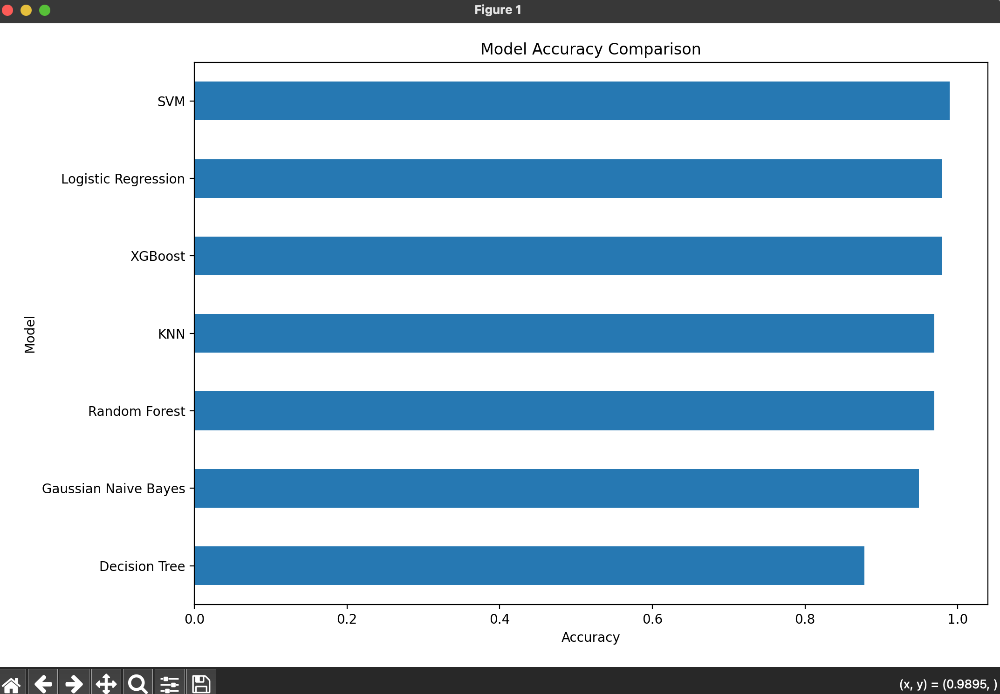
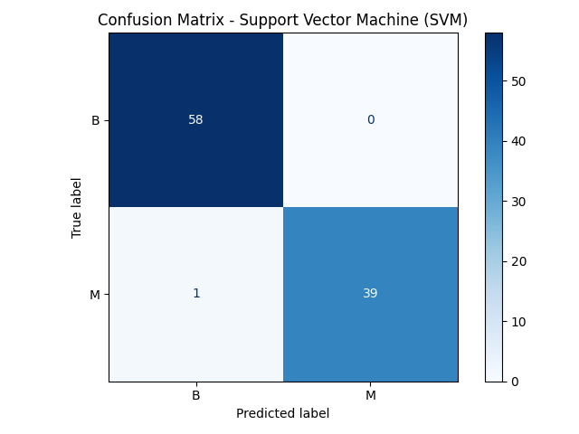
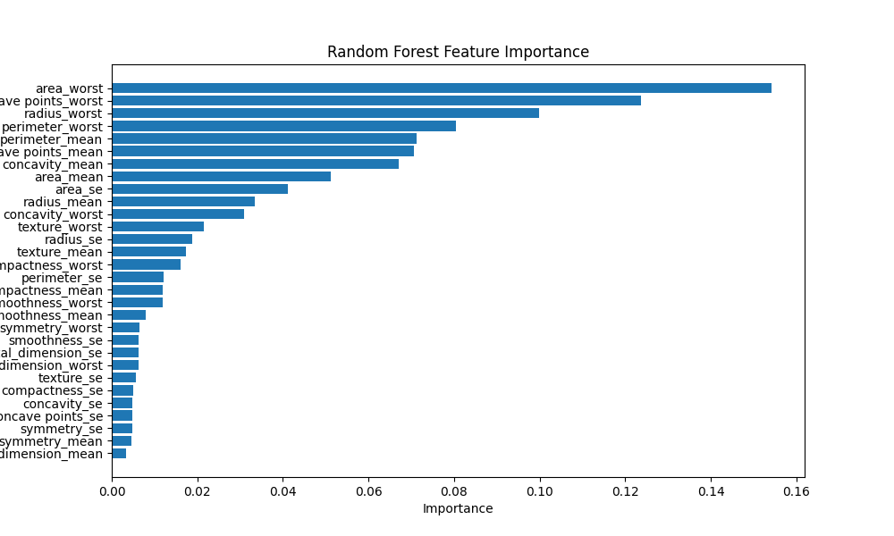

# Breast Cancer Prediction & Model Benchmarking System

## Overview

An end-to-end machine learning system designed to predict breast cancer diagnoses using clinical tumor measurements while benchmarking multiple classification algorithms within a unified evaluation framework.

The project combines data preprocessing, model comparison, explainability analysis, and automated visualization generation to identify the most reliable predictive models and the most influential diagnostic features.

---

## Highlights

* Benchmarked 7 machine learning classification algorithms
* Achieved **98.98% accuracy** using Support Vector Machines (SVM)
* Implemented automated preprocessing, scaling, and outlier handling pipelines
* Evaluated models using Accuracy, Precision, Recall, F1 Score, and ROC-AUC
* Generated explainability outputs through feature importance and coefficient analysis
* Produced automated visual reports and exported evaluation metrics

---
## Model Performance Comparison

The chart below compares the predictive performance achieved by each machine learning algorithm evaluated throughout the project.



## Models Evaluated

* Support Vector Machine (SVM)
* Logistic Regression
* XGBoost
* Random Forest
* K-Nearest Neighbors (KNN)
* Decision Tree
* Gaussian Naive Bayes

---

## Performance Results

| Model                  | Accuracy |
| ---------------------- | -------: |
| Support Vector Machine |   98.98% |
| Logistic Regression    |   97.96% |
| XGBoost                |   97.96% |
| Random Forest          |   96.94% |
| K-Nearest Neighbors    |   96.94% |
| Gaussian Naive Bayes   |   94.90% |
| Decision Tree          |   87.76% |

---

## Best Performing Model

Support Vector Machines (SVM) achieved the highest classification accuracy of **98.98%**. The confusion matrix below illustrates the model's ability to correctly distinguish between benign and malignant tumor cases.



## Key Insights

Feature importance analysis consistently identified the following tumor characteristics as the strongest predictors:

* Area (Worst)
* Perimeter (Worst)
* Radius (Worst)
* Concave Points (Worst)
* Area (Mean)

These features demonstrated the highest predictive influence across multiple machine learning models.

---
## Feature Importance Analysis

Random Forest feature importance analysis highlights the tumor characteristics that contributed most strongly to diagnostic predictions.



## Project Visualizations

### Model Performance Comparison

Compares predictive accuracy across all evaluated machine learning algorithms.

### SVM Confusion Matrix

Visualizes classification performance of the highest-performing model.

### Feature Importance Analysis

Highlights the diagnostic features that contributed most significantly to model predictions.

---

## Technology Stack

### Programming

* Python

### Data Processing

* Pandas
* NumPy
* SciPy

### Machine Learning

* Scikit-Learn
* XGBoost

### Visualization

* Matplotlib

---

## Repository Structure

```text
breast-cancer-prediction-model/

├── breast_cancer_prediction.py
├── breast-cancer.csv
├── requirements.txt
├── README.md

├── images/
└── results/
```

---

## Future Enhancements

* Hyperparameter Optimization
* Cross Validation
* SHAP Explainability
* ROC Curve Analysis
* Model Deployment
* Interactive Prediction Dashboard
